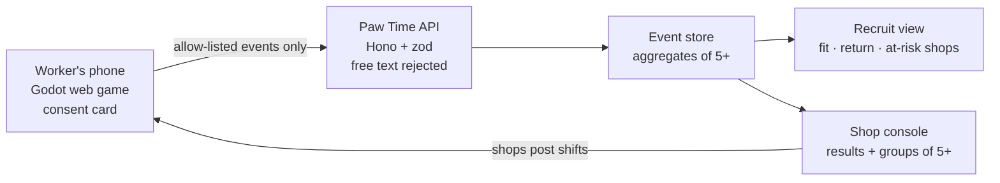

# Paw Time — Let's work together

**AI now floods job applications, so an application no longer tells anyone who will fit. Only outcome data does — and job apps can't collect it, because people open them only to search.**
Paw Time is a cozy cat-obake game that spot workers open every day. Your cat brings shifts that fit, works your real shift with you, and gets tired so you stop overworking. Because it is opened daily, it sees what job apps never see: interest before applying, and whether the job fit after the shift.

Team Dry Grape · Recruit Holdings Innovation Cup 2026 · [日本語の README](README.ja.md)

## For judges: start here

| What | Link |
|---|---|
| **Play the game** (phone or desktop, no login) | https://paw-time-play.vercel.app |
| **3-minute guided demo** | On the title screen, tap **“3-minute demo”** (about 95 seconds, ends in the Recruit view) |
| Presentation deck (PDF) | [docs/deck/PawTime_TeamDryGrape.pdf](docs/deck/PawTime_TeamDryGrape.pdf) |
| Recruit view (behavior data as a database, synthetic data) | https://paw-time-insights.vercel.app |
| Shop console (jobs, applicants, shifts, chat, reviews & island, labor cost; sample data) | https://paw-time-employer.vercel.app |
| Launch page | https://paw-time-launch.vercel.app |

- The first load takes about 20–30 seconds (a 3D game running in the browser).
- The English build is set in San Francisco with USD; the **日本語** link on the title switches to Japan and yen.
- All job listings, shops and numbers are **samples**. No real workers or payments.
- Judging build: scooping and hatching work at any hour, so every feature can be tried right away. In the real product the river opens at 5 PM and orbs hatch in the morning.

## The problem
- Applications per recruiter are up 412%; about 254 people apply to each job, and $20 buys AI mass-applying (Greenhouse data, *Fortune*, Jul 2026).
- 4.52 million people do spot work in Japan, and 65% of them hit problems on the job (Persol Research Institute, 2024 survey).
- Job apps see one of four moments — the application. Before it, during the shift and after it, the worker is invisible.

## The solution
1. **Pick** — your obaneko brings 3–4 shifts that fit your area, hours and wage.
2. **Work** — during your real shift your cat works too; past 7.5 hours it gets tired: “let’s both head home.” Working longer never earns more.
3. **Night** — scoop glowing orbs; **Morning** — they hatch into materials, outfits and, rarely, a new cat (six special cats have reveal clips).
4. **Island** — build your island, dress your cat, visit friends’ and shops’ islands. A shop’s island grows **only** from positive reviews.
5. **Recruit view** — fit and return signals, shown only as aggregates of 5+ people.

Everyone wins: workers get shifts that fit and a cat that tells them to rest; shops get people who show up and come back; Recruit gets fit-and-stay data after the hire.

## How it is built



| Part | Path | Stack |
|---|---|---|
| Game (worker app) | `apps/worker` | Godot 4.7 (GL Compatibility / WebGL2), GDScript, custom toon + outline shaders, Blender-built 3D, EN/JA via `tr()` |
| API | `apps/api` | TypeScript, Hono + zod, OpenAPI contracts (`packages/api-contracts`), Vercel |
| Shop console | `apps/employer` | Next.js 15, React 19, rules in `packages/shop-console` (minimum wage by slot date, 5+ aggregation, CSV export) |
| Recruit view | `apps/insights` | TypeScript, Chart.js |
| Launch page | `apps/marketing` | Static HTML |
| Deck & media | `docs/deck` | Slide sources, story script (`docs/pitch.md`), gameplay GIFs/MP4s |

**Trust by design:** shops never get a score on an individual worker; anything under 5 people is shown as “fewer than 5”; the cat never passes a worker’s words to the shop (chat stays on device, only fixed tags); coins are never cash and never touch wages; the only purchases are cosmetics.

**AI tools used:** Claude Code and OpenAI Codex for development; Codex for UI parts and icons; MiniMax Hailuo 3 for the rare-cat reveal clips; Google Lyria 3 for music. The team reviewed and is responsible for all content.

## Run it locally

```sh
# Game (Godot 4.7.x)
godot --path apps/worker                      # open / run
godot --headless --path apps/worker --import  # first time
OBAKE_NOSAVE=1 godot --headless --path apps/worker -s tests/test_review3.gd   # a test

# API, shop console, Recruit view
pnpm install
pnpm dev        # shop console http://localhost:3000, API http://localhost:8787
pnpm test && pnpm typecheck && pnpm build
```

More: [docs/onboarding.md](docs/onboarding.md) (Japanese), [docs/architecture/monorepo.md](docs/architecture/monorepo.md), game spec [apps/worker/README.en.md](apps/worker/README.en.md).
